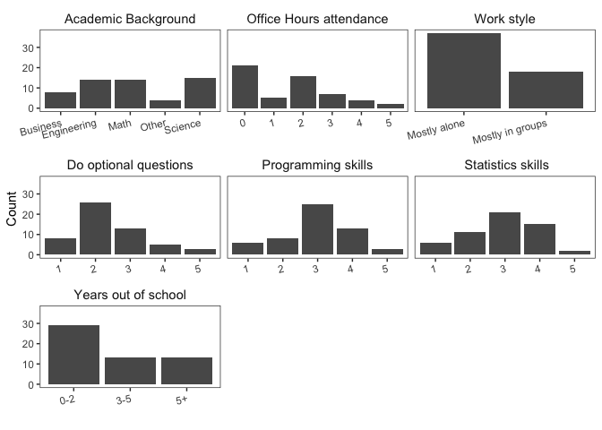
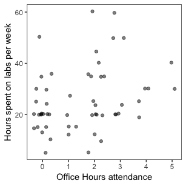

Relationship between attending office hours and average number of hours
spent on labs per week
================
Betty Zhou, Juno Chen, Olivia Lin, Orphelia Ellogne
April 12, 2019

# Introduction

In an accelerated program, such as the Master of Data Science (MDS),
students are often limited on time. As MDS students, we are highly
interested in investigating whether attending office hours helped MDS
students complete their lab assignments in a shorter amount of time.

Therefore, the main question addressed by our study is:

**How does the number of times a Master of Data Science (MDS) student
goes to office hours affect the average number of hours they spend
working on labs per week?**

# Confounding Variables

To ensure that our study is as causal as possible, we considered the
following potential confounding variables:

1.  **Working style**: whether someone prefers to work alone or in
    groups. Working style may be a confounding variable as someone
    working in groups may have enough support to complete labs without
    going to office hours. At the same time, someone working in groups
    may spend more time discussing lab questions and thus spend more
    time on labs.

2.  **Academic background**: Science, Engineering, Math, Business, or
    Other. Since MDS courses are heavily statistics and computer science
    based, we suspect someone with a statistics or computer science
    background are less likely to go to office hours. Furthermore,
    someone with a statistics or computer science background are more
    likely to finish labs faster because they are more rehearsed in the
    topics covered by the MDS curriculum.

3.  **Number of years out-of-school**: 0-2, 3-5, 5+ years. The longer
    someone has been out-of-school, the more likely for them to not be
    used to school routines and thus, more likely to struggle
    academically. Therefore, the longer someone has been out-of-school,
    the more likely someone will go to office hours to ask for help. At
    the same time, this student may not go to office hours, but spend
    more time on labs just because they are struggling.

4.  **Programming skills**: rated from 1 (low) to 5 (high). The amount
    of time an MDS student spends on lab might not only be affected by
    their understanding of the concepts but also by their ability to
    translate their understanding into code. A student with strong
    programming skills might be efficient at the latter and spend less
    time on labs. At the same time this student might be less likely to
    need any help with coding, hence less likely to go to office hours.

5.  **Statistical skills**: rated from 1 (low) to 5 (high). A student
    with strong statistical knowledge might understand concepts of
    certain MDS courses more quickly and spend less time on labs. At the
    same time, this student may require less help with concepts, hence
    less likely to go to office hours.

6.  **Attempts optional questions**: rated from 1 (never) to 5 (always).
    A student who decides to solve optional questions probably
    understands the material well, and thus, is less likely to go to
    office hours. On the other hand, compared to a person who only does
    mandatory questions, this student might spend more time working on
    labs.

# Method

## Survey

We conducted a
[survey](https://ubc.ca1.qualtrics.com/jfe/form/SV_6JSd6n3qKwaU4yp) with
questions using the above confounders via Qualtrics. The anonymous
survey was sent to 2018 MDS cohorts. We did not include any unique
identifiers in the survey.

## Data

Our [sample
data](https://github.ubc.ca/bettybhz/Hours_Spent_On_Labs_Survey_Data)
for this study would be the 56 responses we received, which we consider
a good representation of the population. We eliminated any identifiable
information to protect the privacy. We stored the data on a github
repository with access restricted to our team members and teaching
staff.

First we would perform Exploratory Data Analysis(EDA) and observe the
charts, where we eliminate the unrelated confounders, i.e. confounders
those do not show an obvious impact on the relationship between time we
spend on the lab and office hours attended. For the remaining
confounders, we would apply regression to further examine the effects of
confounding variables.

# Exploratory Data Analysis

We first explored the distribution of our features. As shown by the plot
below, our sample is dominated by students with an Engineering
(15),Science (15) and Math (14) background. The majority of respondents
were out of school between 0 and 2 years before joining the program.

38 participants mostly work alone while 18 mostly work in groups. On a
scale of 1 (low) to 5(high), most students rated their programming and
statistical skills as average (3). Also, on a sacle of 1(never) to
5(always) most students attempt optional questions sometimes (2).

Most students do not attend office hours but few students go to office
hours 5 times a week. One participant did not report whether they attend
office hours.

<!-- -->

***Figure 1: Distribution of explanatory variables***

Then, we plotted the number of times students attend office hours per
week against the average number of hours spent on labs (Figure 2).

<!-- -->

***Figure 2: Relationship between attending office hours and average
number of hours spent on labs per week***

The above plot shows that there is no apparent relatioship between the
two variables of interest. We then included potential confounding
variables in the plot to explore whether attending office hours and
hours spent on labs are indirectly related. We found that only 3 out of
6 variables seem to matter: attempting optional questions, programming
and statistical skills (Figure 3).

<!-- -->

***Figure 3: Relationship between attending office hours and time spent
on labs per number of optional questions attempts as well as programming
and statistical skills***

# Statistical Analysis and Results

# Discussion

## Survey Design and Assumption

We thoroughly considered all the possible confounders and chose the ones
we think would make our study as causal as possible. To ensure the
flexibility of performing various types of statistical analysis, we
prepared the data by creating proper questions and grouped answers for
the confounders. Our study also included careful assessment on the
confounders (EDA and regression analysis) to provide solid evidence for
our final result.

## Limitations

One main limitation on our study was the sample size being too small.
There are several consequences from this for our causal study. Some of
the answers to our questions were categorical, such as the academic
background, while some others were grouped, such as the years out of
school. For these variables, as we have very limited amount of
responses, there are not enough data points in one or more of these
groups to support strong relationships between the variables. Also, the
outliers would have a bigger impact on the regression model when there
are not enough data points to balance. We are not eliminating any
potential outliers due to the size of our data.

Another potential problem would be the scoring for the last two
questions, programming skills and statistical skills, being subjective.
The absolute level of one’s professional skills might be different from
the self evaluated result. we do not have enough data points to support
a solid conclusion on the relationship between the confounding variables

## Future Improvements

If we could conduct our study further in the future, we would try to
increase the number of respondents. It would be more informative if we
could include previous MDS cohorts. Also, as we are focusing on the
relationship between “attending office hours” and “time spent on
labs(assignments)”, while our confounding variables are highly academic
related, we could organize similar surveys to post graduate students in
related programs.

For self-evaluated questions, we could utilize some courses or
certificate exams that all respondents would have experienced, such as
“do you find DSCI 512 to be difficult” rather than “rate your
programming skills”. It should bring the responses to be on the same
scale.
