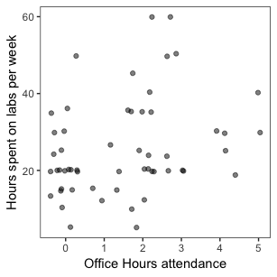

Relationship between attending office hours and average number of hours spent on labs per week
================
Betty Zhou, Juno Chen, Olivia Lin, Orphelia Ellogne
April 12, 2019

Introduction
============

In an accelerated program, such as the Master of Data Science (MDS), students are often limited on time. As MDS students, we are highly interested in investigating whether attending office hours helped MDS students complete their lab assignments in a shorter amount of time.

Therefore, the main question addressed by our study is:

**How does the number of times a Master of Data Science (MDS) student goes to office hours affect the average number of hours they spend working on labs per week?**

Confounding Variables
=====================

To ensure that our study is as causal as possible, we considered the following potential confounding variables:

<table style="width:88%;">
<colgroup>
<col width="11%" />
<col width="20%" />
<col width="27%" />
<col width="27%" />
</colgroup>
<thead>
<tr class="header">
<th align="left">Variable Name</th>
<th align="left">Type</th>
<th align="left">Values</th>
<th align="left">Description</th>
</tr>
</thead>
<tbody>
<tr class="odd">
<td align="left">Lab hours</td>
<td align="left">response variable</td>
<td align="left">numerical: integer</td>
<td align="left">Hours someone spends per week working on labs</td>
</tr>
<tr class="even">
<td align="left">Attend office hours</td>
<td align="left">explanatory variable</td>
<td align="left">numerical: integer</td>
<td align="left">Times per week someone attends office hours</td>
</tr>
<tr class="odd">
<td align="left">Working style</td>
<td align="left">confounder</td>
<td align="left">categorical: mostly groups, mostly alone</td>
<td align="left">Whether someone prefers to work alone or in group</td>
</tr>
<tr class="even">
<td align="left">Academic background</td>
<td align="left">confounder</td>
<td align="left">categorical: Science, Engineering, Math, Business, Other</td>
<td align="left">Someone's academic background before joining MDS</td>
</tr>
<tr class="odd">
<td align="left">Number of years out-of-school</td>
<td align="left">confounder</td>
<td align="left">categorical: 0-2, 3-5, 5+</td>
<td align="left">How many years someone has been out of school</td>
</tr>
<tr class="even">
<td align="left">Programming skills</td>
<td align="left">confounder</td>
<td align="left">numerical: rated from 1 (low) to 5 (high)</td>
<td align="left">Self rating of programming skills</td>
</tr>
<tr class="odd">
<td align="left">Statistical skills</td>
<td align="left">confounder</td>
<td align="left">numerical: rated from 1 (low) to 5 (high)</td>
<td align="left">Self rating of statistical skills</td>
</tr>
</tbody>
</table>

Method
======

Survey
------

We conducted a [survey](https://ubc.ca1.qualtrics.com/jfe/form/SV_6JSd6n3qKwaU4yp) with questions using the above confounders via Qualtrics. The anonymous survey was sent to 2018 MDS cohorts. We did not include any unique identifiers in the survey.

Data
----

56 students participated in the survey. We believe Our [sample data](https://github.ubc.ca/bettybhz/Hours_Spent_On_Labs_Survey_Data) is a good representation of the population. We eliminated any identifiable information to protect the privacy of respondents. We stored the data on a github repository with access restricted to our team members and teaching staff.

First we performed [Exploratory Data Analysis(EDA)](2.2_Survey_Response_EDA.ipynb), analyzed the charts and eliminated confounders that do not show an obvious impact on the relationship between time spent on the labs and attending office hours . For the remaining confounders, we [fitted different regressions](2.1_Survey_Response_Regression.ipynb) to further examine their effects.

Exploratory Data Analysis
=========================

We first explored the distribution of our features. As shown by the plot below, our sample is dominated by students with an Engineering (15),Science (15) and Math (14) background. The majority of respondents were out of school between 0 and 2 years before joining the program.

38 participants mostly work alone while 18 mostly work in groups. On a scale of 1 (low) to 5(high), most students rated their programming and statistical skills as average (3). Also, on a scale of 1(never) to 5(always) most students attempt optional questions sometimes (2).

Most students do not attend office hours but few students go to office hours 5 times a week. One participant did not report whether they attend office hours.

***Figure 1: Distribution of explanatory variables***

Then, we plotted the number of times students attend office hours per week against the average number of hours spent on labs (Figure 2).

***Figure 2: Relationship between attending office hours and average number of hours spent on labs per week***

The above plot shows that there is no apparent relationship between the two variables of interest. We then included potential confounding variables in the plot to explore whether attending office hours and average number of hours spent on labs are indirectly related. We found that only 3 out of 6 variables seem to matter: attempting optional questions, programming and statistical skills (Figure 3).

***Figure 3: Relationship between attending office hours and time spent on labs per number of optional questions attempts as well as programming and statistical skills***

Statistical Analysis and Results
================================

Hypothesis
----------

**Null hypothesis:** The number of times a MDS student attends office hours does not affect the average number of hours spent working on labs per week.

**Alternative hypothesis:** The number of times a MDS student attends office hours affects the average number of hours spent working on labs per week.

Regression Models
-----------------

Since our response variable `lab_hours` (i.e maximum hours per week) is non-negative and bounded between 0 and 168 hours, we analyzed the survey results using regression with a log-link transformation. According to our exploratory data analysis, three variables, `optional`, `stat`, and `program`, caught our attention and we believed they are potential confounding variables. Therefore, we used these three variables, together with our explanatory variable `attend_OH` and response variable `lab_hours` for our model.

### Baseline Model

*E*(*Y*)=*e**x**p*(*β*0 + *β*attend\_OH*X*attend\_OH)

Our baseline model is to regress `lab_hours` only on `attend_OH`. We used this model as a reference to evaluate and compare other models.

<table>
<thead>
<tr>
<th style="text-align:left;">
term
</th>
<th style="text-align:right;">
estimate
</th>
<th style="text-align:right;">
std.error
</th>
<th style="text-align:right;">
statistic
</th>
<th style="text-align:right;">
p.value
</th>
</tr>
</thead>
<tbody>
<tr>
<td style="text-align:left;">
(Intercept)
</td>
<td style="text-align:right;">
3.0868434
</td>
<td style="text-align:right;">
0.1018507
</td>
<td style="text-align:right;">
30.307525
</td>
<td style="text-align:right;">
0.0000000
</td>
</tr>
<tr>
<td style="text-align:left;">
attend\_OH
</td>
<td style="text-align:right;">
0.0972797
</td>
<td style="text-align:right;">
0.0406405
</td>
<td style="text-align:right;">
2.393664
</td>
<td style="text-align:right;">
0.0202532
</td>
</tr>
</tbody>
</table>
**Table 1: Regression Coefficients for Baselien Model**

According to Table 1, we can see the coefficient for `attend_OH` is 0.097 with p-value of 0.02 for our baseline model. The 95% confidence interval for *β*attend\_OH is (0.0176, 0.177).

### Model 1 with Optional Questions

*E*(*Y*)=*e**x**p*(*β*0 + *β*attend\_OH*X*attend\_OH + *β*optional*X*optional)

<table>
<thead>
<tr>
<th style="text-align:left;">
term
</th>
<th style="text-align:right;">
estimate
</th>
<th style="text-align:right;">
std.error
</th>
<th style="text-align:right;">
statistic
</th>
<th style="text-align:right;">
p.value
</th>
</tr>
</thead>
<tbody>
<tr>
<td style="text-align:left;">
(Intercept)
</td>
<td style="text-align:right;">
3.2096799
</td>
<td style="text-align:right;">
0.1879594
</td>
<td style="text-align:right;">
17.076449
</td>
<td style="text-align:right;">
0.0000000
</td>
</tr>
<tr>
<td style="text-align:left;">
attend\_OH
</td>
<td style="text-align:right;">
0.0958509
</td>
<td style="text-align:right;">
0.0409677
</td>
<td style="text-align:right;">
2.339668
</td>
<td style="text-align:right;">
0.0231758
</td>
</tr>
<tr>
<td style="text-align:left;">
optional
</td>
<td style="text-align:right;">
-0.0505327
</td>
<td style="text-align:right;">
0.0635608
</td>
<td style="text-align:right;">
-0.795030
</td>
<td style="text-align:right;">
0.4302100
</td>
</tr>
</tbody>
</table>
**Table 2: Regression Coefficients for Model 1**

<table>
<thead>
<tr>
<th style="text-align:left;">
term
</th>
<th style="text-align:right;">
df
</th>
<th style="text-align:right;">
Deviance
</th>
<th style="text-align:right;">
Resid..Df
</th>
<th style="text-align:right;">
Resid..Dev
</th>
<th style="text-align:right;">
statistic
</th>
<th style="text-align:right;">
p.value
</th>
</tr>
</thead>
<tbody>
<tr>
<td style="text-align:left;">
NULL
</td>
<td style="text-align:right;">
NA
</td>
<td style="text-align:right;">
NA
</td>
<td style="text-align:right;">
54
</td>
<td style="text-align:right;">
8592.109
</td>
<td style="text-align:right;">
NA
</td>
<td style="text-align:right;">
NA
</td>
</tr>
<tr>
<td style="text-align:left;">
attend\_OH
</td>
<td style="text-align:right;">
1
</td>
<td style="text-align:right;">
818.88788
</td>
<td style="text-align:right;">
53
</td>
<td style="text-align:right;">
7773.221
</td>
<td style="text-align:right;">
5.5483027
</td>
<td style="text-align:right;">
0.0223056
</td>
</tr>
<tr>
<td style="text-align:left;">
optional
</td>
<td style="text-align:right;">
1
</td>
<td style="text-align:right;">
98.40167
</td>
<td style="text-align:right;">
52
</td>
<td style="text-align:right;">
7674.820
</td>
<td style="text-align:right;">
0.6667119
</td>
<td style="text-align:right;">
0.4179254
</td>
</tr>
</tbody>
</table>
**Table 3: Comparison between Baseline Model and Model 1**

According to Table 2, the coefficient for `attend_OH` is 0.096, which is within the 95% confidence interval (0.0176, 0.177) from the baseline model. According to Table 3, our ANOVA F-test also shows that adding the variable optional does not help improve our model. Therefore, the variable `optional` is not a true confounding variable and we will not be included in our final model.

### Model 2 with Statistical Skills

*E*(*Y*)=*e**x**p*(*β*0 + *β*attend\_OH*X*attend\_OH + *β*stat*X*stat)

<table>
<thead>
<tr>
<th style="text-align:left;">
term
</th>
<th style="text-align:right;">
estimate
</th>
<th style="text-align:right;">
std.error
</th>
<th style="text-align:right;">
statistic
</th>
<th style="text-align:right;">
p.value
</th>
</tr>
</thead>
<tbody>
<tr>
<td style="text-align:left;">
(Intercept)
</td>
<td style="text-align:right;">
2.8416988
</td>
<td style="text-align:right;">
0.2509507
</td>
<td style="text-align:right;">
11.323734
</td>
<td style="text-align:right;">
0.0000000
</td>
</tr>
<tr>
<td style="text-align:left;">
attend\_OH
</td>
<td style="text-align:right;">
0.1107115
</td>
<td style="text-align:right;">
0.0427523
</td>
<td style="text-align:right;">
2.589603
</td>
<td style="text-align:right;">
0.0124347
</td>
</tr>
<tr>
<td style="text-align:left;">
stat
</td>
<td style="text-align:right;">
0.0762707
</td>
<td style="text-align:right;">
0.0677905
</td>
<td style="text-align:right;">
1.125093
</td>
<td style="text-align:right;">
0.2657159
</td>
</tr>
</tbody>
</table>
**Table 4: Regression Coefficients for Model 2**

<table>
<thead>
<tr>
<th style="text-align:left;">
term
</th>
<th style="text-align:right;">
df
</th>
<th style="text-align:right;">
Deviance
</th>
<th style="text-align:right;">
Resid..Df
</th>
<th style="text-align:right;">
Resid..Dev
</th>
<th style="text-align:right;">
statistic
</th>
<th style="text-align:right;">
p.value
</th>
</tr>
</thead>
<tbody>
<tr>
<td style="text-align:left;">
NULL
</td>
<td style="text-align:right;">
NA
</td>
<td style="text-align:right;">
NA
</td>
<td style="text-align:right;">
54
</td>
<td style="text-align:right;">
8592.109
</td>
<td style="text-align:right;">
NA
</td>
<td style="text-align:right;">
NA
</td>
</tr>
<tr>
<td style="text-align:left;">
attend\_OH
</td>
<td style="text-align:right;">
1
</td>
<td style="text-align:right;">
818.8879
</td>
<td style="text-align:right;">
53
</td>
<td style="text-align:right;">
7773.221
</td>
<td style="text-align:right;">
5.618480
</td>
<td style="text-align:right;">
0.0215152
</td>
</tr>
<tr>
<td style="text-align:left;">
stat
</td>
<td style="text-align:right;">
1
</td>
<td style="text-align:right;">
194.3135
</td>
<td style="text-align:right;">
52
</td>
<td style="text-align:right;">
7578.908
</td>
<td style="text-align:right;">
1.333207
</td>
<td style="text-align:right;">
0.2535143
</td>
</tr>
</tbody>
</table>
**Table 5: Comparison between Baseline Model and Model 2**

According to Table 4, the coefficient for `attend_OH` is 0.111, which is within the 95% confidence interval (0.0176, 0.177) from the baseline model. According to Table 5, our ANOVA F-test also shows that adding the variable `stat` does not help improve our model. Therefore, the variable `stat` is not a true confounding variable and we will not be included in our final model.

### Model 3 with Programming Skills

*E*(*Y*)=*e**x**p*(*β*0 + *β*attend\_OH*X*attend\_OH + *β*program*X*program)

<table>
<thead>
<tr>
<th style="text-align:left;">
term
</th>
<th style="text-align:right;">
estimate
</th>
<th style="text-align:right;">
std.error
</th>
<th style="text-align:right;">
statistic
</th>
<th style="text-align:right;">
p.value
</th>
</tr>
</thead>
<tbody>
<tr>
<td style="text-align:left;">
(Intercept)
</td>
<td style="text-align:right;">
3.3652191
</td>
<td style="text-align:right;">
0.2132434
</td>
<td style="text-align:right;">
15.781120
</td>
<td style="text-align:right;">
0.0000000
</td>
</tr>
<tr>
<td style="text-align:left;">
attend\_OH
</td>
<td style="text-align:right;">
0.0874046
</td>
<td style="text-align:right;">
0.0407013
</td>
<td style="text-align:right;">
2.147466
</td>
<td style="text-align:right;">
0.0364382
</td>
</tr>
<tr>
<td style="text-align:left;">
program
</td>
<td style="text-align:right;">
-0.0901529
</td>
<td style="text-align:right;">
0.0626183
</td>
<td style="text-align:right;">
-1.439722
</td>
<td style="text-align:right;">
0.1559394
</td>
</tr>
</tbody>
</table>
**Table 6: Regression Coefficients for Model 3**

<table>
<thead>
<tr>
<th style="text-align:left;">
term
</th>
<th style="text-align:right;">
df
</th>
<th style="text-align:right;">
Deviance
</th>
<th style="text-align:right;">
Resid..Df
</th>
<th style="text-align:right;">
Resid..Dev
</th>
<th style="text-align:right;">
statistic
</th>
<th style="text-align:right;">
p.value
</th>
</tr>
</thead>
<tbody>
<tr>
<td style="text-align:left;">
NULL
</td>
<td style="text-align:right;">
NA
</td>
<td style="text-align:right;">
NA
</td>
<td style="text-align:right;">
54
</td>
<td style="text-align:right;">
8592.109
</td>
<td style="text-align:right;">
NA
</td>
<td style="text-align:right;">
NA
</td>
</tr>
<tr>
<td style="text-align:left;">
attend\_OH
</td>
<td style="text-align:right;">
1
</td>
<td style="text-align:right;">
818.8879
</td>
<td style="text-align:right;">
53
</td>
<td style="text-align:right;">
7773.221
</td>
<td style="text-align:right;">
5.696670
</td>
<td style="text-align:right;">
0.0206698
</td>
</tr>
<tr>
<td style="text-align:left;">
program
</td>
<td style="text-align:right;">
1
</td>
<td style="text-align:right;">
298.4055
</td>
<td style="text-align:right;">
52
</td>
<td style="text-align:right;">
7474.816
</td>
<td style="text-align:right;">
2.075886
</td>
<td style="text-align:right;">
0.1556377
</td>
</tr>
</tbody>
</table>
**Table 7: Comparison between Baseline Model and Model 3**

According to Table 6, the coefficient for `attend_OH` is 0.087, which is within the 95% confidence interval (0.0176, 0.177) from the baseline model. According to Table 7, our ANOVA F-test also shows that adding the variable `program` does not help improve our model. Therefore, the variable `program` is not a true confounding variable and will not be included in our final model.

### Conclusion

Based on our Exploratory Data Analysis (EDA), we decided to focus our empirical investigation on three confounding variables `optioanl`, `stat`, and `program`. However, after performing regression and F-test analyses on these variables, we found that they are not true confounding variables and adding these three variables does not improve our model.

Therefore, our final model is the baseline model *E*(*Y*)=*e**x**p*(*β*0 + *β*attend\_OH*X*attend\_OH).

Since the p-value is 0.02 which is small enough, we can reject the null hypothesis under significance level of 0.05. Therefore, the number of times a MDS student attends office hours affects the average number of hours spent working on labs per week. The coefficient for `attend_OH` is 0.097, where exp(0.097) is the effect of attending office hours. This means on average, one visit increase in office hours is expected to increase hours spent on labs per week by 1.1 times.

Discussion
==========

Survey Design and Assumption
----------------------------

We thoroughly considered all the possible confounders and chose the ones we think would make our study as causal as possible. To ensure the flexibility of performing various types of statistical analysis, we prepared the data by creating proper questions and grouped answers for the confounders. Our study also included careful assessment on the confounders (EDA and regression analysis) to provide solid evidence for our final result.

Limitations
-----------

One main limitation on our study was the sample size being too small. There are several consequences from this for our causal study. Some of the answers to our questions were categorical, such as the academic background, while some others were grouped, such as the years out of school. For these variables, as we have very limited amount of responses, there are not enough data points in one or more of these groups to support strong relationships between the variables. Also, the outliers would have a bigger impact on the regression model when there are not enough data points to balance. We are not eliminating any potential outliers due to the size of our data.

Another potential problem would be the scoring for the last two questions, programming skills and statistical skills, being subjective. The absolute level of one's professional skills might be different from the self evaluated result. we do not have enough data points to support a solid conclusion on the relationship between the confounding variables.

Future Improvements
-------------------

If we could conduct our study further in the future, we would try to increase the number of respondents. It would be more informative if we could include previous MDS cohorts. Also, as we are focusing on the relationship between "attending office hours" and "time spent on labs(assignments)", while our confounding variables are highly academic related, we could extend our surveys to post graduate students in related programs.

For self-evaluated questions, we could utilize some courses or certificate exams that all respondents would have experienced, such as "do you find DSCI 512 to be difficult" rather than "rate your programming skills". It should bring the responses to be on the same scale.
